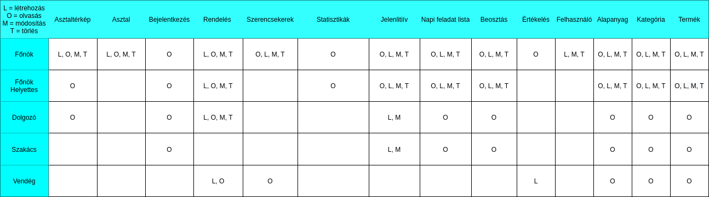
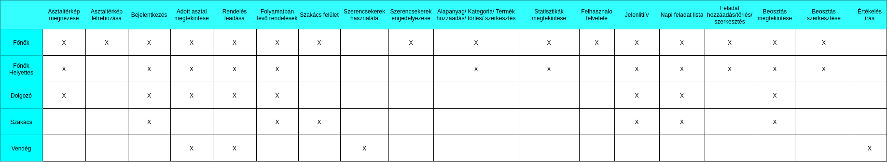

# Vendéglátós Szoftver

## 1. Projekt bemutatása
A szakdolgozatom témája egy olyan szoftver megírása, amit vendéglátós egységekben lehet használni. Az alkalmazás több egységből tevődne össze, egy webalkalmazás, amin keresztül egy asztaltérkép segítségével az asztalokhoz termékeket lehet felvenni, ahol nyomon lehet követni az asztalnál ülő vendégek fogyasztását, és a végén az alkalmazás előállít a vendégnek egy vendégblokkot, ami tartalmazza tételenként a megrendelt ételek és italok árát, mennyiségét. Az asztalhoz felvett termékeket szükség esetén külön székekre lehet bontani abban az esetben, ha a vendégek külön szeretnék rendezni a számlát. A felvett ételek/italok megjelennek a konyhán egy külön felületen. A szakács tudja jelezni, ha nekilátott a feladatnak majd, ha elkészült vele, értesítést küldeni a felszolgálónak.

Az alkalmazás különböző jogosultságokat kezel, mint például: főnök, főnök helyettes, dolgozó, vendég. A főnök a webalkalmazásban az étterem mintájára tud létrehozni asztaltérképet. Lehetősége van termék kategóriák és termékek felvételére. A termékekhez lehet kedvezményt és áfa kulcsot beállítani, ami alapján a program számolja majd a végösszeget. Az ételek elkészítéséhez szükséges alapanyagokat is tudja tárolni a program, ami alapján a szoftver képes lesz a fogyó termékekről bevásárló listát készíteni. A webalkalmazásban vehet fel új munkatársakat különböző jogosultsággal. Az alkalmazottaknak hozhat létre feladatokat, amik a dolgozó feladatlistájában megjelenik illetve, vezetheti a dolgozóinak a beosztását. A dolgozók a nap elején tudják jelezni a programban mikor érkeztek meg, majd a nap végén mikor távoztak, ezek alapján a program kezeli az alkalmazottak jelenlétét, ledolgozott óráit. Az applikációban lehet naplózni a személyzeti fogyasztásokat.

Az alkalmazás statisztikát készítene a termékek fogyásáról, a napi bevételről, amit a megfelelő jogosultsággal bíró alkalmazott megtekinthet. A statisztikai diagramok megjelenítése CanvasJs segítségével történne. A piacon található alkalmazásokkal szemben nem csak statisztikai elemzést készít a program, hanem optimalizálási algoritmussal kiszámolja a bevétel maximalizálását, értem ezalatt, hogy a termék előállításához szükséges alapanyagok darabszáma és termék eladási ára alapján szimplex algoritmussal kiszámolja, hogy miből mennyit kéne eladni a lehető legnagyobb profit elérése érdekében.

A webalkalmazás egyik fő funkciója, ami eltér a többi vendéglátós applikációtól, hogy a szoftver minden asztalhoz egyedi QR kódot készít, amit ha a vendég beolvas, akkor egy mobilbarát webes felületen az adott asztalhoz megrendelheti a kívánt termékeket. Ennek előnye, hogy nem kell alkalmazást letölteni hozzá, vagy a vendéglátó egységnek elektronikai eszközt kihelyeznie erre a célra, hanem a vendég a saját mobileszközén tudja leadni rendelését. További előnyei közé tartozik, hogy nincs szükség pincérekre, akik felveszik a rendelést, ezáltal sokkal gyorsabban hozzájuthatnak a kívánt ételeikhez. A még nagyobb gyorsaság növelés érdekében, az asztalnál ülők egyszerre többen is beolvashatják a QR kódot, ami után mindenki egy becenevet megadva leadhatja a rendelését. Miután kiválasztották a termékeket, lehetőségük nyílik egy szerencsekerékkel pörgetniük, amivel különböző akciókat, termékeket nyerhetnek. Az ételt felszolgáló az asztalsorszám és a becenevek segítségével tudhatja, hogy melyik asztalhoz vigye, és ott majd kit keressen a megrendelt termékkel. A vendég bármikor megtekintheti milyen termékek vannak a kosarában. Az alkalmazásban a megvásárolt tételek listáját le tudják menteni telefonjukra pdf formában.

### 1.1. Megvalósítás
Az alkalmazás MVC tervezési mintát követne. A webes felületet fejlesztése php nyelven Yii keretrendszerben történne, amihez hozzá társulna Vuejs és bootstrap.
A php és html kódokat smarty-val különíteném el egymástól a jobb átláthatóság kedvéért. A forráskód az átláthatósága érdekében psr-12 kódolási stílus szabályai
alapján írnám. Az adatokat MySQL adatbázisban tárolnám. 

## 2. Ütemterv

### 1. mérföldkő (2021.09.01- 2021.09.30)
Munkafolyamat megtervezése, dokumentációk készítése.
- Egyed-kapcsolat diagram
- Relációs adatmodell
- Osztály diagram
- Szerep-funkció mátrix
- Egyed-esemény mátrix

### 2. mérföldkő (2021.10.01- 2021.10.31)
Webalkalmazás alapjainak létrehozása
Adatbázis táblák megírása
Asztaltérkép és eladó felület implementálása

### 3. mérföldkő (2021.11.01- 2021.11.30)
Asztalhoz QR kód generálás
Vendég rendelési felület létrehozása

### 4. mérföldkő (2021.12.01- 2021.12.31)
Vendég rendelési felület továbbfejlesztése
Konyha felület implementálása

### 5. mérföldkő (2022.01.01- 2022.01.31)
Statisztika modul

### 6. mérföldkő (2022.02.01- 2022.02.28)
Dolgozó napi listája
Kiegészítő funkciók implementálása
Tesztelés, felmerülő hibák javítása
Dokumentáció piszkozat készítése

### 7. mérföldkő (2022.03.01- 2022.03.31)
Dokumentáció készítése

### 8. mérföldkő (2022.04.01- 2022.04.30)
Dokumentáció folytatása, befejezése

## 3. Dokumentáció

#### 3.1. Egyed-esemény mátrix

#### 3.2. Szerep-funkció mátrix

#### 3.3. Egyed-kapcsolat diagram

#### 3.4. Relációs adatmodell
- Asztal(**id**, QR kód, x, y)
- Rendelés(**id**, *asztalid*, ár, állapot, kedvezmeny)
- RendeltTermekek(**id**, *rendelesid*, *termekid*)
- Szerencsekerek(**id**, nev, ertek)
- Alapanyag(**id**, nev, mennyiseg, mertekegyseg)
- Kategoria(**id**, nev, afa kulcs, allergen)
- Termek(**id**, *kategoriaid*, ar)
- TermekOsszetevoi(*termekid*, *alapanyagid*)
- NapiBevetel(**id**, datum, ar)
- Felhasznalo(**belepesi_azonosito**, nev, jelszo, jog, szuletesi_ido, lakcim, telefon, adoazonosito)
- Jelenlitiiv(**id**, *felhasznalo_id*, erkezet, tavozott)
- NapiLista(**id**, *felhasznalo_id*, név, leiras, *felvette*, fontossag, allapot)
- Beosztas(**id**, *felhasznalo_id*, datum, kezdes, tavozas)
- Vendeglatohely(**nev**, adoszam, cím, telefon)
- DolgozoFogyasztas(**id**, *felhasznalo_id*, *termekid*)
- Ertekelesek(**id**, nev, leiras, pont)

#### 3.5. Osztály diagram
